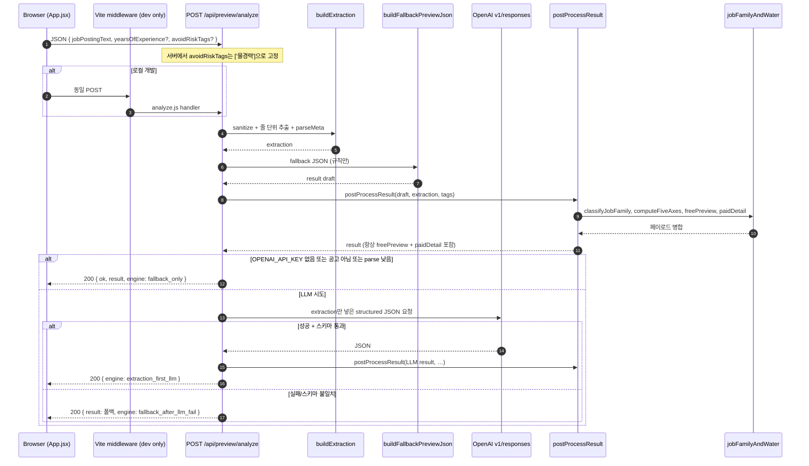

# 채용공고 미리보기 분석: 시퀀스 & 프론트 매핑

개발자 온보딩용 한 페이지 요약. 구현 기준은 `api/preview/analyze.js`, `api/preview/jobFamilyAndWater.js`, `src/App.jsx`이다.  
`docs/커서 채용공고 분석 프로세스.txt`는 과거 설명이 섞일 수 있으니, 분석 동작은 이 문서와 위 파일을 우선한다.

---

## 시퀀스 (요청 ~ 응답)

**요점**

- 최종 판단 일관성: `supportDecision`, `keyPoints`, `avoidConditionMatches` 등은 LLM 이후에도 `postProcessResult`가 **규칙으로 다시 맞춤**.
- LLM은 막히지 않음: 예외 시에도 **HTTP 200 + 폴백 `result`**.

---

## 응답 `result` → `App.jsx` UI 매핑

`fetchPreviewAnalyzeApi`는 `data.result`만 state(`previewResult`)에 넣는다.

| 구간 | 조건 | 사용하는 필드 | 화면 역할 |
|------|------|----------------|-----------|
| 잠금(미결제) | `!isUnlocked` | `freePreview` | 직무군 라벨, 한 줄 헤드라인, top 근거, 짧은 이유, 확인 질문 1개 |
| 잠금 | `freePreview` 없음 | — | “형식을 불러오지 못했어요” 안내 |
| 해제(결제 후) | `isUnlocked` | `paidDetail` (우선) | 요약·직무군, 5축 리스트, 핵심 근거, 면접 질문(+ ifGood/ifRisky), actionGuide |
| 해제 | `paidDetail` 없을 때 폴백 | `avoidConditionMatches`, `missingInformation`, `keyPoints`, `interviewQuestions` | 상세 블록을 레거시 스키마로 채움 |

`engine` 필드는 현재 UI에서 표시하지 않음(로깅·디버깅용으로 쓰기 좋음).

---

## 관련 환경변수

| 변수 | 영향 |
|------|------|
| `OPENAI_API_KEY` | 없으면 LLM 분기 생략 → `fallback_only` |
| `OPENAI_MODEL` | 미설정 시 `gpt-4o` (`analyze.js`) |

---

## 파일 인덱스

| 파일 | 역할 |
|------|------|
| `api/preview/analyze.js` | 핸들러, 추출, 폴백, LLM, postProcess 진입 |
| `api/preview/jobFamilyAndWater.js` | 직무군, 5축, `freePreview` / `paidDetail` 조립 |
| `src/App.jsx` | `fetchPreviewAnalyzeApi`, 미리보기/상세 섹션 렌더 |
| `vite.config.js` (로컬) | `/api/preview/analyze` → 동일 핸들러 연결 |
